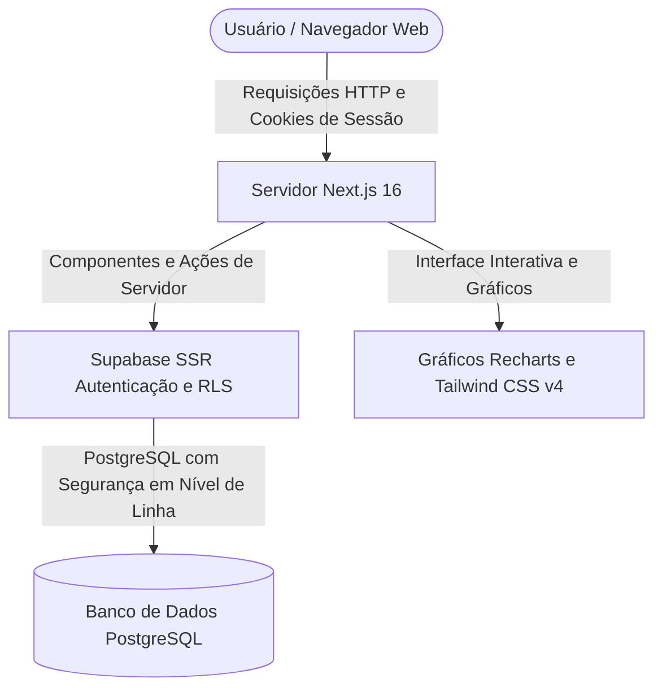
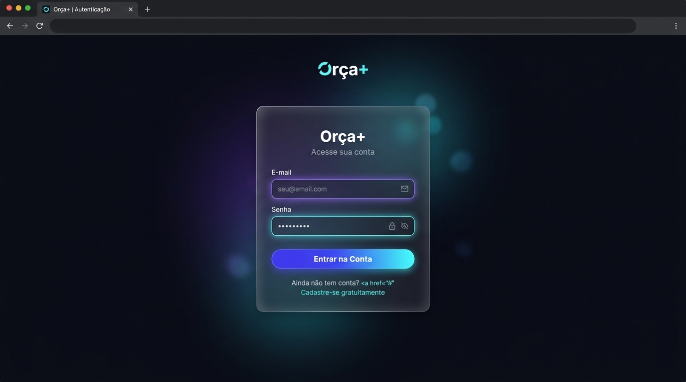
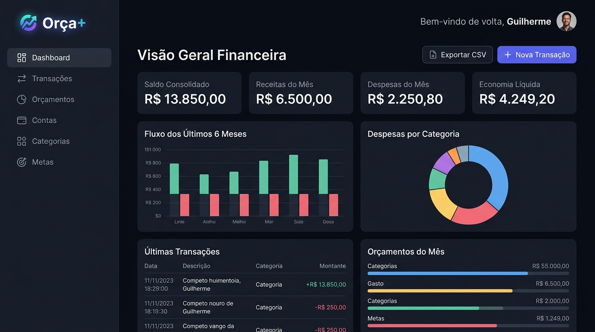
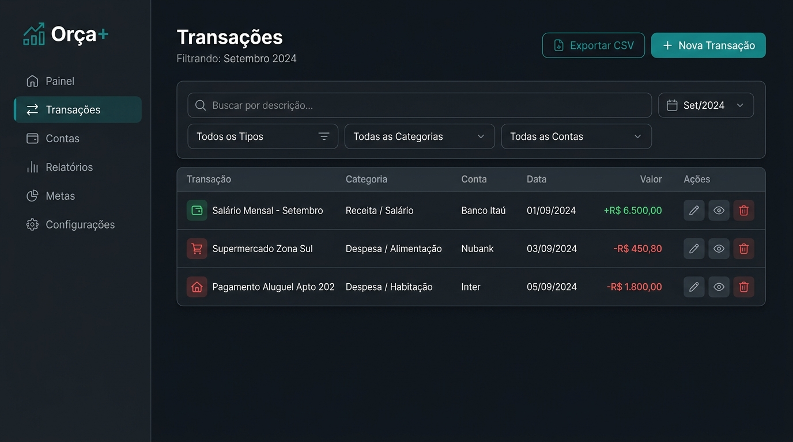
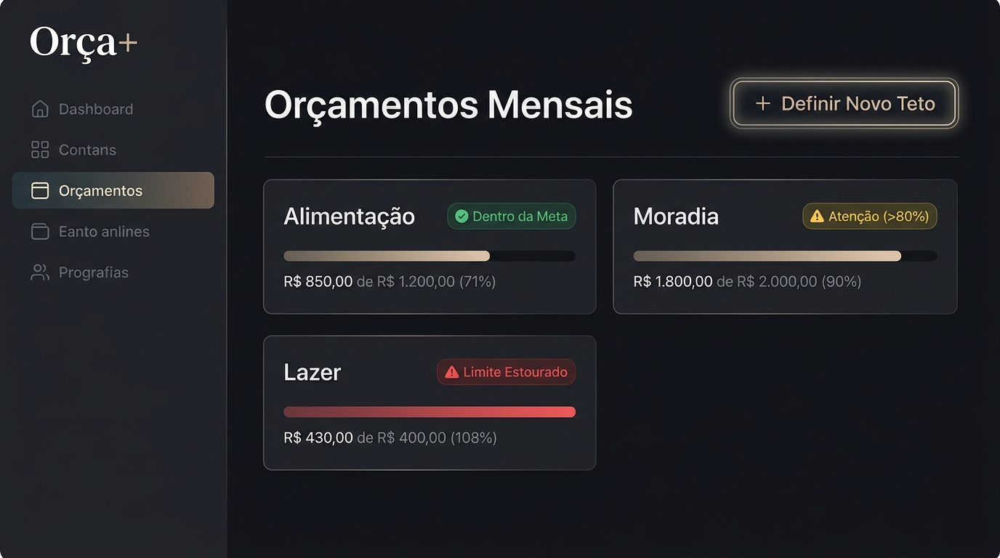
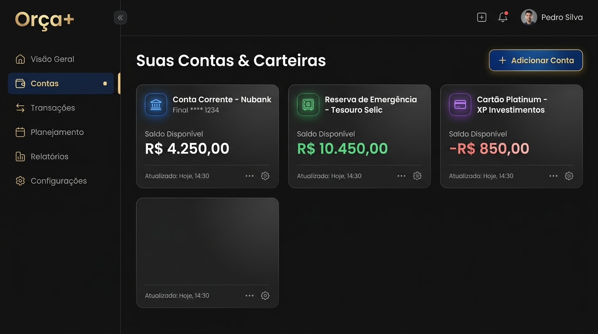

# 💰 Orça+ — Sistema de Gestão Financeira Pessoal

[](https://nextjs.org/)
[](https://react.dev/)
[](https://www.typescriptlang.org/)
[](https://tailwindcss.com/)
[](https://supabase.com/)
[](https://www.conventionalcommits.org/pt-br/)

O **Orça+** é uma aplicação web completa e segura para controle e planejamento financeiro pessoal, projetada com foco em alto desempenho, proteção rigorosa de dados e uma experiência visual moderna (tema escuro, efeitos visuais translúcidos e micro-animações). O projeto foi desenvolvido inteiramente em **Português do Brasil (pt-BR)** com valores expressos em **Reais (R$)**.

---

## 📑 Sumário

- [Visão Geral e Arquitetura](#-visão-geral-e-arquitetura)
- [Demonstração Visual e Passo a Passo das Telas](#-demonstração-visual-e-passo-a-passo-das-telas)
- [Recursos Principais do Sistema](#-recursos-principais-do-sistema)
- [Tecnologias Utilizadas](#-tecnologias-utilizadas)
- [Estrutura de Pastas do Projeto](#-estrutura-de-pastas-do-projeto)
- [Instalação e Execução Local Passo a Passo](#-instalação-e-execução-local-passo-a-passo)
- [Configuração do Banco de Dados no Supabase](#-configuração-do-banco-de-dados-no-supabase)
- [Estratégia de Ramificações no Git (Git Flow)](#-estratégia-de-ramificações-no-git-git-flow)
- [Padrão de Mensagens de Commit (Conventional Commits)](#-padrão-de-mensagens-de-commit-conventional-commits)
- [Segurança e Proteção de Dados](#-segurança-e-proteção-de-dados)
- [Licença](#-licença)

---

## 🏛️ Visão Geral e Arquitetura

O sistema adota a arquitetura de ponta do **Next.js App Router** com **Componentes de Servidor (Server Components)** para carregamento ultrarrápido de dados e **Ações de Servidor (Server Actions)** seguras com validação de dados via **Zod**.

O banco de dados relacional **PostgreSQL** é hospedado no **Supabase** e protegido por **Segurança em Nível de Linha (Row Level Security - RLS)** em 100% das tabelas, garantindo que nenhum usuário tenha acesso aos lançamentos financeiros de outra pessoa.



---

## 📸 Demonstração Visual e Passo a Passo das Telas

Abaixo está o guia visual detalhado que ilustra o fluxo completo de utilização da aplicação:

---

### Passo 1: Página Inicial de Apresentação (Landing Page)
> **Rota no navegador:** `/`


- **Boas-Vindas e Apresentação Visual**: Recepção do visitante com tema escuro e iluminação ambiente em tons de azul-índigo e verde-esmeralda.
- **Botões de Ação Direta**:
  - **"Começar Agora"**: Direciona o novo usuário para o formulário de cadastro gratuito.
  - **"Ver Demonstração"**: Leva diretamente ao painel analítico da plataforma.
- **Cartões de Destaque**: Resumo das três principais propostas de valor do sistema: Orçamentos Inteligentes, Painéis em Tempo Real e Proteção de Dados em Nível de Linha.

---

### Passo 2: Autenticação Segura (Login e Cadastro)
> **Rotas no navegador:** `/login` e `/register`



- **Acesso com E-mail e Senha**: Formulário protegido com validação de formato e comprimento de campos pelo Zod.
- **Mensagens Claras de Alerta**: Avisos instantâneos e objetivos em caso de senha incorreta ou campos não preenchidos.
- **Sessão Persistente via Cookies**: O login é mantido de forma segura pelo navegador utilizando cookies transmitidos via cabeçalhos HTTP pelo servidor.
- **Criação Automática de Dados Iniciais**: Ao concluir o cadastro, o banco de dados executa um gatilho automático que cria o perfil, uma "Conta Principal" e 12 categorias financeiras padrão para o usuário já começar utilizando o sistema imediatamente.

---

### Passo 3: Painel Principal (Dashboard Analítico)
> **Rota no navegador:** `/dashboard`



- **Indicadores Financeiros Principais (KPIs)**:
  - **Saldo Consolidado**: Soma em tempo real do patrimônio líquido distribuído entre todas as contas.
  - **Receitas do Mês**: Total acumulado de entradas monetárias no mês atual.
  - **Despesas do Mês**: Total de saídas computadas no mês.
  - **Economia Líquida**: Saldo positivo (superávit) ou negativo (déficit) gerado no período.
- **Gráficos Analíticos Dinâmicos**:
  - *Fluxo dos Últimos 6 Meses*: Comparação mensal em barras entre total de receitas (verde) e total de despesas (vermelho).
  - *Despesas por Categoria*: Gráfico de rosca colorido ilustrando a proporção de gastos em cada categoria.
- **Ações Rápidas do Cabeçalho**:
  - Botão **"Nova Transação"**: Abre uma janela flutuante para cadastrar receitas e despesas sem sair da tela.
  - Botão **"Exportar CSV"**: Baixa instantaneamente uma planilha com todos os lançamentos.

---

### Passo 4: Extrato Completo de Transações e Filtros
> **Rota no navegador:** `/transactions`



- **Busca por Texto em Tempo Real**: Campo de pesquisa rápida que filtra instantaneamente as transações pelo nome da descrição.
- **Filtros Simultâneos**: Seleção refinada por Tipo (Todas, Apenas Receitas ou Apenas Despesas), Categoria e Conta Bancária.
- **Estrutura da Tabela**:
  - Identificação por ícones indicativos de entrada ou saída.
  - Etiquetas coloridas com o nome da categoria.
  - Formatação da data no padrão brasileiro (`DD/MM/AAAA`).
  - Formatação monetária em Reais (`+ R$ 6.500,00` em verde ou `- R$ 450,80` em vermelho).
- **Exclusão de Lançamento**: Botão com confirmação para apagar transações incorretas e recalcular saldos imediatamente.

---

### Passo 5: Orçamentos Mensais com Alertas de Gastos
> **Rota no navegador:** `/budgets`



- **Definição de Tetos por Categoria**: Estabelecimento do valor máximo que o usuário pretende gastar em Alimentação, Moradia, Lazer, etc.
- **Barras de Progresso Inteligentes com Alertas Visuais**:
  - 🟢 **Dentro da Meta**: Consumo abaixo de 80% do teto mensal (etiqueta verde indicando controle financeiro saudável).
  - 🟡 **Atenção (>80%)**: Alerta preventivo com barra em amarelo quando os gastos se aproximam do limite estabelecido.
  - 🔴 **Limite Estourado (100%+)**: Destaque de alerta em vermelho informando que o orçamento foi ultrapassado e exibindo o montante excedido.
- **Criação de Novos Orçamentos**: Janela modal para estipular o limite máximo para qualquer categoria e mês do ano.

---

### Passo 6: Contas Bancárias e Carteiras
> **Rota no navegador:** `/accounts`



- **Diferentes Modalidades Financeiras**: Cadastro de Conta Corrente, Poupança / Reserva de Emergência, Cartão de Crédito, Dinheiro em Espécie e Investimentos.
- **Controle Individualizado de Saldos**: Exibição clara do saldo disponível em cada instituição financeira ou carteira física.
- **Identificação Visual**: Cada conta possui uma cor personalizada e um ícone temático correspondente ao seu tipo.

---

## ✨ Recursos Principais do Sistema

- 📊 **Visão Geral Consolidada**: Saldos, receitas, despesas e resultado líquido calculados em tempo real.
- 📈 **Gráficos com Biblioteca Recharts**: Histórico comparativo semestral e distribuição proporcional de gastos por categoria.
- 💳 **Gestão Descentralizada de Contas**: Múltiplas contas correntes, cartões e reservas de emergência.
- 🏷️ **Categorização de Transações**: Separação estruturada de despesas e receitas com cores e ícones customizáveis.
- 🎯 **Monitoramento de Metas Orçamentárias**: Tetos de despesas com aviso visual preventivo em 80% e alerta de estouro em 100%.
- 📥 **Exportação para Planilhas**: Download de relatórios em formato CSV formatado em UTF-8 compatível com Excel e Google Planilhas.
- 🔒 **Proteção Total com RLS**: As consultas ao banco utilizam o identificador exclusivo do usuário autenticado no Supabase, impedindo qualquer vazamento de dados.

---

## 🛠️ Tecnologias Utilizadas

| Camada da Aplicação | Tecnologia | Descrição em Português |
| :--- | :--- | :--- |
| **Ambiente / Framework** | Next.js 16+ (App Router) | Renderização híbrida no servidor com Ações de Servidor (Server Actions) |
| **Linguagem de Programação** | TypeScript 5+ | Tipagem forte e estrita de ponta a ponta |
| **Estilização e Design** | Tailwind CSS v4 | Estilos utilitários nativos, tema escuro e efeitos translúcidos |
| **Banco de Dados e Auth** | Supabase | PostgreSQL gerenciado com autenticação segura via cookies no servidor |
| **Validação de Dados** | Zod | Validação robusta de esquemas de formulários no servidor |
| **Gráficos Interativos** | Recharts | Gráficos modernos de barras e rosca para análise financeira |
| **Ícones de Interface** | Lucide React | Biblioteca moderna de ícones vetoriais leves |

---

## 📁 Estrutura de Pastas do Projeto

```
app-orcamento-pessoal/
├── docs/
│   └── images/                             # Imagens e capturas de tela para documentação
├── supabase/
│   ├── migrations/
│   │   ├── 001_schema_and_rls.sql          # Criação das tabelas e políticas de segurança RLS
│   │   └── 002_triggers_and_defaults.sql   # Gatilho para criação de dados no cadastro
│   └── README.md                           # Instruções de configuração do banco no Supabase
├── src/
│   ├── app/
│   │   ├── (auth)/                         # Páginas públicas de autenticação (Login e Cadastro)
│   │   ├── (dashboard)/                    # Páginas privadas com menu lateral e cabeçalho
│   │   │   ├── dashboard/page.tsx          # Painel financeiro principal
│   │   │   ├── transactions/page.tsx       # Extrato completo com filtros
│   │   │   ├── budgets/page.tsx            # Gestão de tetos de orçamentos mensais
│   │   │   ├── accounts/page.tsx           # Gestão de contas bancárias e carteiras
│   │   │   ├── categories/page.tsx         # Cadastro e lista de categorias
│   │   │   └── goals/page.tsx              # Metas financeiras de economia
│   │   ├── api/export-csv/                 # Rota interna para download de planilha CSV
│   │   ├── globals.css                     # Variáveis visuais, tema escuro e estilos globais
│   │   └── layout.tsx                      # Estrutura raiz configurada para o idioma pt-BR
│   ├── components/
│   │   ├── ui/                             # Componentes base: Botão, Campo de Texto, Janela Modal, Cartão
│   │   ├── layout/                         # Barra Lateral (Sidebar), Topo (Topbar) e Navegação Mobile
│   │   ├── dashboard/                      # Indicadores numéricos, Gráficos e Listas resumidas
│   │   ├── transactions/                   # Tabela de lançamentos e formulário de nova transação
│   │   ├── budgets/                        # Cartões de orçamentos e formulário de limites
│   │   └── accounts/                       # Cartões de contas e formulário de novas contas
│   ├── lib/
│   │   ├── supabase/                       # Conexões seguras com o Supabase no navegador e servidor
│   │   ├── validations/                    # Regras de validação de formulários com Zod
│   │   ├── actions/                        # Ações de servidor para salvar e excluir dados
│   │   └── data/finance.ts                 # Cálculos de saldos, totais e séries temporais
│   ├── types/
│   │   └── database.types.ts               # Tipos TypeScript do modelo de banco de dados
│   └── middleware.ts                       # Proteção de rotas e verificação de login
├── .env.example                            # Modelo público de variáveis de ambiente
├── .gitignore                              # Regras para ignorar arquivos locais no Git
├── next.config.ts                          # Configurações do servidor Next.js
├── package.json                            # Lista de dependências e comandos do projeto
└── tsconfig.json                           # Configurações do compilador TypeScript
```

---

## 🚀 Instalação e Execução Local Passo a Passo

### Pré-requisitos
- **Node.js** na versão 20 ou superior instalado no computador.
- Gerenciador de pacotes **npm** (incluso com o Node.js).
- Uma conta gratuita criada na plataforma [Supabase](https://supabase.com).

### 1. Clonar o Repositório
Abra o terminal do seu computador e execute:
```bash
git clone https://github.com/SEU_USUARIO/app-orcamento-pessoal.git
cd app-orcamento-pessoal
```

### 2. Instalar as Dependências
Execute o comando abaixo para baixar as bibliotecas necessárias:
```bash
npm install
```

### 3. Configurar as Variáveis de Ambiente
Crie o arquivo local de configuração baseado no modelo:
```bash
cp .env.example .env.local
```
Abra o arquivo `.env.local` em seu editor e preencha com as credenciais do seu projeto Supabase:
```env
NEXT_PUBLIC_SUPABASE_URL=https://seu-projeto.supabase.co
NEXT_PUBLIC_SUPABASE_ANON_KEY=sua-chave-publica-anonima-aqui
NEXT_PUBLIC_APP_URL=http://localhost:3000
```

### 4. Iniciar a Aplicação em Modo de Desenvolvimento
Inicie o servidor local:
```bash
npm run dev
```
Abra o seu navegador de internet e acesse:
👉 **[http://localhost:3000](http://localhost:3000)**

---

## 🗄️ Configuração do Banco de Dados no Supabase

Para preparar as tabelas e regras de segurança no seu projeto Supabase:

1. Acesse o painel do seu projeto no site do [Supabase](https://supabase.com).
2. No menu lateral esquerdo, clique em **SQL Editor** e depois em **New Query** (Nova Consulta).
3. Abra e copie todo o conteúdo do arquivo `supabase/migrations/001_schema_and_rls.sql` e clique no botão **Run** (Executar). Esse script cria as tabelas de perfis, contas, categorias, transações e orçamentos, ativando as regras de proteção RLS.
4. Em seguida, crie outra consulta, copie o conteúdo do arquivo `supabase/migrations/002_triggers_and_defaults.sql` e execute. Esse script ativa a criação automática de categorias e da conta inicial ao realizar novos cadastros.
5. No menu **Authentication** > **Providers** > **Email**, certifique-se de que a autenticação por e-mail está habilitada. *(Dica: em ambiente de desenvolvimento local, você pode desmarcar a opção "Confirm email" para realizar login imediato sem precisar confirmar o link na caixa de entrada).*

---

## 🌿 Estratégia de Ramificações no Git (Git Flow)

O repositório adota o modelo de fluxo de trabalho baseado no **Git Flow simplificado**, garantindo rastreabilidade, isolamento de novas funcionalidades e segurança no ambiente de produção:

```
[main] ──────────────────────────●──────────── (Versão estável em produção)
                                 ▲
                                 │ Solicitação de Envio (Pull Request)
[develop] ──────●────────────────●────●────── (Ambiente de integração e testes contínuos)
                ▲                     ▲
                │ Pull Request        │ Pull Request
[feature/*] ────●                     │
[fix/*] ──────────────────────────────●
```

### 1. Ramificações Principais
- **`main`**: Contém exclusivamente código aprovado e estável em produção. **Protegida contra alterações diretas**; modificações só entram por meio de Solicitações de Envio (Pull Requests) aprovadas após revisão.
- **`develop`**: Ramificação principal de integração. É onde todas as novas funcionalidades testadas são reunidas antes do lançamento de uma nova versão estável.

### 2. Ramificações Temporárias de Trabalho
- **`feature/<nome-da-funcionalidade>`**: Utilizada para desenvolver novas funcionalidades isoladas (exemplo: `feature/exportacao-pdf`, `feature/grafico-anual`). É criada a partir de `develop` e mesclada de volta em `develop`.
- **`fix/<nome-da-correcao>`**: Utilizada para corrigir falhas encontradas durante os testes na branch `develop`.
- **`hotfix/<nome-do-ajuste-urgente>`**: Utilizada para correções emergenciais aplicadas diretamente sobre o código em produção. É criada a partir de `main` e mesclada tanto em `main` quanto em `develop`.

---

## ✍️ Padrão de Mensagens de Commit (Conventional Commits)

Todas as mensagens de salvamento de código (commits) devem seguir o padrão internacional [Conventional Commits](https://www.conventionalcommits.org/pt-br/):

```
<tipo>(<escopo opcional>): <descrição curta em português no modo imperativo>

[descrição detalhada das mudanças (opcional)]

[referências a tarefas ou chamados (opcional)]
```

### Tipos de Commits Aceitos:
- **`feat`**: Adição de uma nova funcionalidade (exemplo: `feat(transacoes): adicionar filtros por periodo de datas`).
- **`fix`**: Correção de um erro ou comportamento inesperado (exemplo: `fix(auth): corrigir redirecionamento apos cadastro`).
- **`docs`**: Alterações exclusivas em arquivos de documentação (exemplo: `docs(readme): atualizar guia de telas passo a passo`).
- **`style`**: Ajustes de formatação visual ou espaçamentos que não alteram a lógica (exemplo: `style(dashboard): ajustar opacidade dos cartoes`).
- **`refactor`**: Reestruturação interna do código sem alterar suas regras de funcionamento (exemplo: `refactor(financeiro): otimizar calculo de saldo acumulado`).
- **`test`**: Criação ou ajuste de testes automatizados (exemplo: `test(validacoes): adicionar testes unitarios para esquema de transacoes`).
- **`chore`**: Tarefas de manutenção de dependências ou configurações de ambiente (exemplo: `chore(deps): atualizar biblioteca recharts`).

---

## 🛡️ Segurança e Proteção de Dados

- **Proteção Total contra Vazamento de Segredos**: O arquivo `.gitignore` bloqueia estritamente `.env`, `.env*.local` e quaisquer chaves privadas. Apenas o modelo demonstrativo `.env.example` sem dados sensíveis é enviado ao repositório público.
- **Isolamento de Dados por Usuário (RLS)**: O banco de dados do Supabase utiliza a função `auth.uid() = user_id` em todas as tabelas. Mesmo se uma consulta tentar buscar registros de terceiros, o banco de dados bloqueia o acesso no nível do PostgreSQL.
- **Validação Rigorosa no Servidor**: Todas as informações recebidas em formulários passam por validação estrita com Zod nas Ações de Servidor antes de chegarem ao banco de dados.

---

## 📜 Licença

Este projeto é distribuído sob os termos da licença aberta **MIT**. Consulte o arquivo [LICENSE](LICENSE) para obter mais informações.
